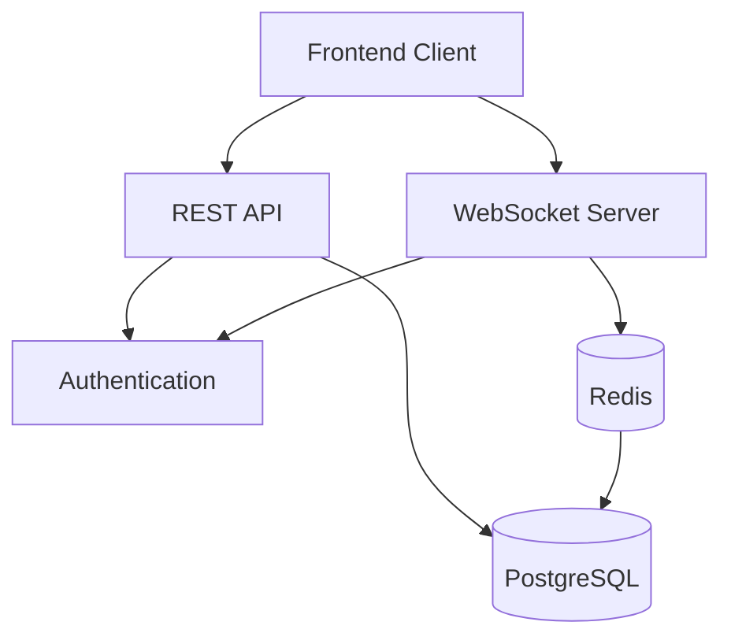

# 🏗 Architecture Overview

## System Architecture

### Core Components

1. **User Service**

   - User authentication and authorization
   - Profile management
   - Session handling
   - Social media integration

2. **Notification Service**

   - Real-time notifications via WebSocket
   - Notification persistence
   - Read status tracking
   - Soft deletion support

3. **Infrastructure**
   - PostgreSQL database
   - Redis for WebSocket channels
   - Nginx reverse proxy (Production)

### Data Flow



## Database Schema

### Users

```sql
-- Core user table (Django default)
CREATE TABLE auth_user (
    id SERIAL PRIMARY KEY,
    username VARCHAR(150) UNIQUE,
    email VARCHAR(254),
    password VARCHAR(128),
    is_active BOOLEAN,
    date_joined TIMESTAMP
);

-- Extended user profile
CREATE TABLE users_profile (
    id SERIAL PRIMARY KEY,
    user_id INTEGER REFERENCES auth_user(id),
    name VARCHAR(255),
    title VARCHAR(100),
    is_available BOOLEAN,
    social_links JSONB
);
```

### Notifications

```sql
CREATE TABLE notifications_notification (
    id SERIAL PRIMARY KEY,
    recipient_id INTEGER REFERENCES auth_user(id),
    actor_id INTEGER REFERENCES auth_user(id),
    notification_type VARCHAR(50),
    message TEXT,
    data JSONB,
    is_read BOOLEAN,
    is_deleted BOOLEAN,
    created_at TIMESTAMP,
    updated_at TIMESTAMP
);
```

## Service Communication

### REST API

- Uses Django REST Framework
- JWT authentication
- Rate limiting
- Swagger documentation

### WebSocket

- Django Channels for WebSocket support
- Redis as channel layer
- Authentication middleware
- Real-time notifications

## Environment Configuration

### Development

```env
DEBUG=True
API_REQUIRE_AUTH=True
CORS_ALLOWED_ORIGINS=http://localhost:3000
```

### Production

```env
DEBUG=False
API_REQUIRE_AUTH=True
SECURE_SSL_REDIRECT=True
CORS_ALLOWED_ORIGINS=https://your-domain.com
```

## Performance Optimizations

1. **Database**

   - Optimized indexes
   - Soft deletion
   - JSON field for flexible data

2. **Caching**

   - Redis for WebSocket channels
   - Session caching
   - Static file caching

3. **Security**
   - HTTPS enforcement
   - CORS protection
   - XSS prevention
   - CSRF tokens
