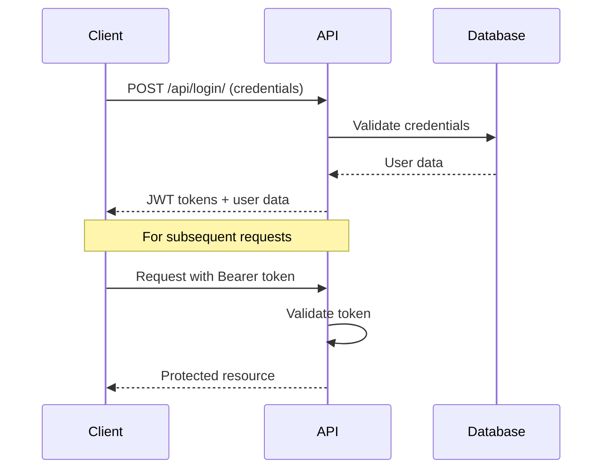
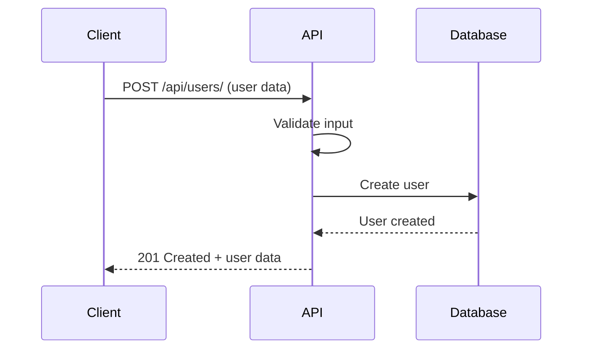
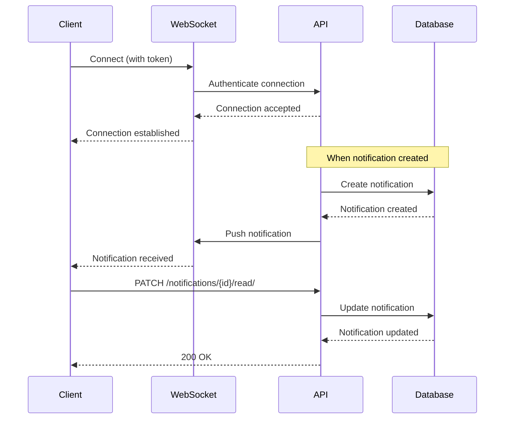
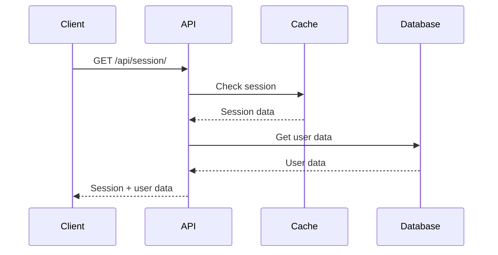

# API Flow Diagrams

This directory contains flow diagrams illustrating the API request/response cycles and data flow for key features of the Personal Backend API.

## Authentication Flow

## User Registration Flow

## Real-time Notifications Flow

## Session Management Flow

## Data Flow Patterns

### Request Flow

1. Client sends request with authentication
2. API validates authentication
3. API processes request
4. Database operations (if needed)
5. Response returned to client

### WebSocket Flow

1. Client establishes WebSocket connection
2. Real-time events pushed to client
3. Client acknowledges events
4. Connection maintained for continuous updates

### Error Flow

1. Client sends invalid request
2. API validates and catches error
3. Error response returned with appropriate status code
4. Client handles error appropriately

## Notes

- All diagrams are created using Mermaid.js syntax
- Diagrams show simplified flows, actual implementations may have additional steps
- Authentication is required for most endpoints (except public ones)
- WebSocket connections require valid JWT token
- Error handling is implemented at each step
