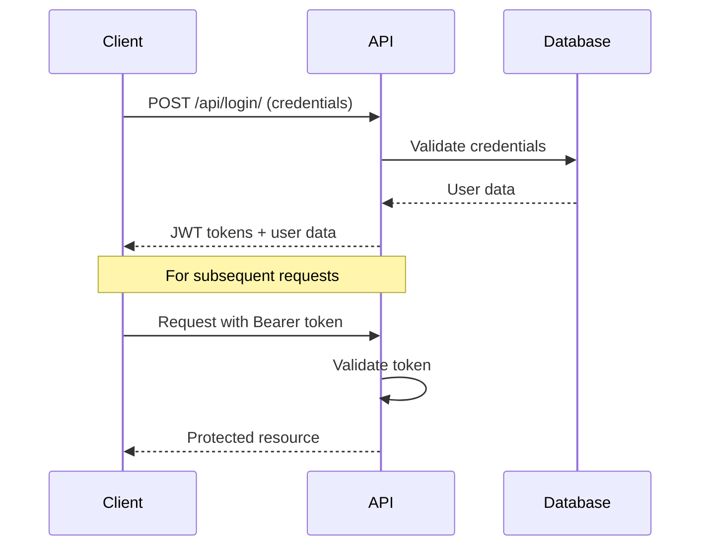
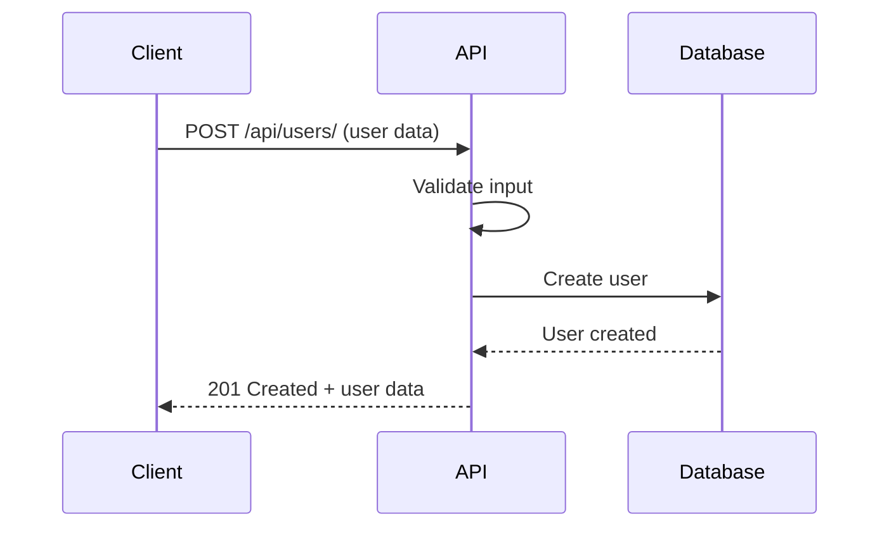
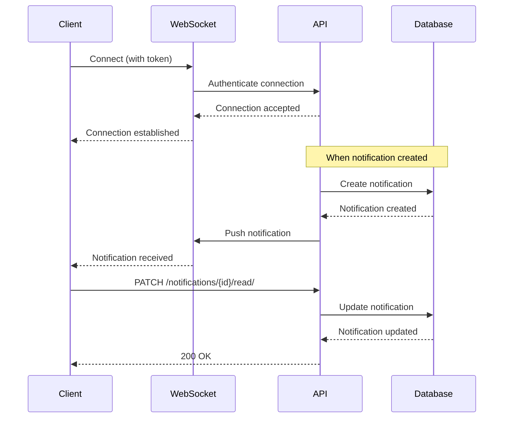
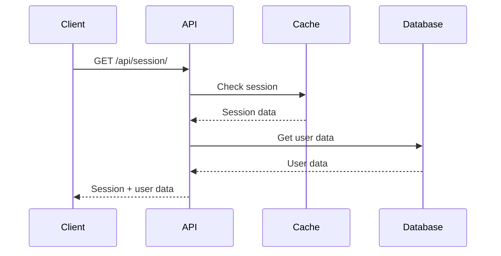
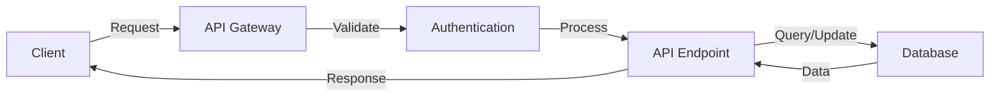
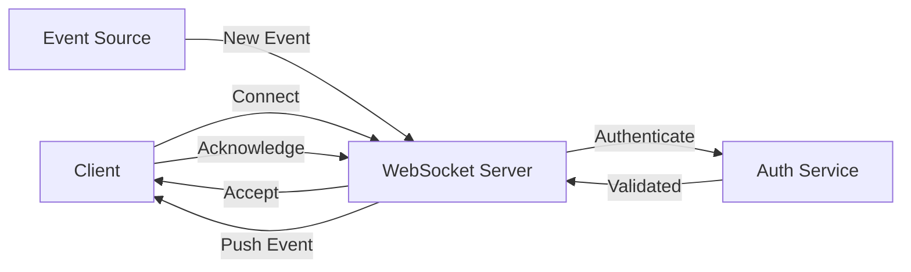
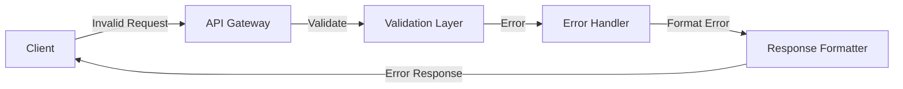
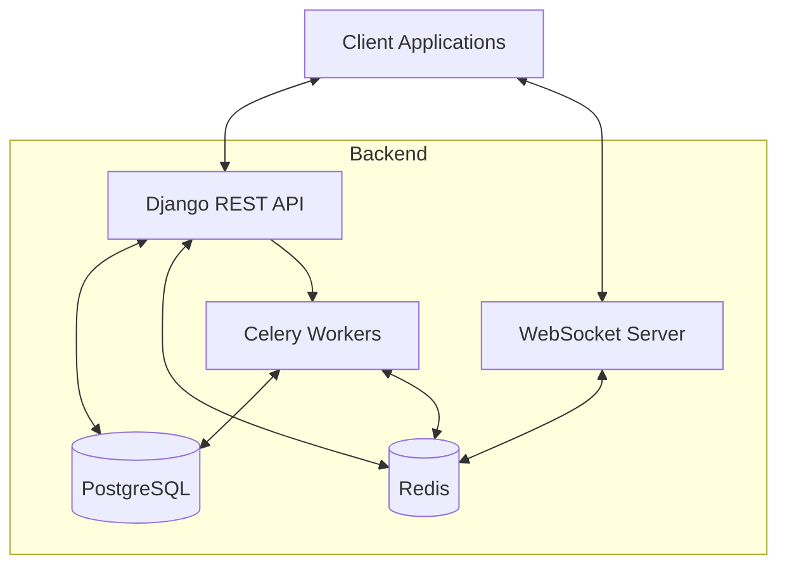

# 📊 API Flow Diagrams

This directory contains flow diagrams illustrating the API request/response cycles and data flow for key features of the Personal Backend API. These diagrams help visualize the interactions between different components of the system.

## 📑 Table of Contents

1. [Authentication Flow](#authentication-flow)
2. [User Registration Flow](#user-registration-flow)
3. [Real-time Notifications Flow](#real-time-notifications-flow)
4. [Session Management Flow](#session-management-flow)
5. [Data Flow Patterns](#data-flow-patterns)
6. [System Architecture](#system-architecture)

## 🔐 Authentication Flow

The following diagram illustrates the JWT authentication flow:

## 👤 User Registration Flow

The following diagram illustrates the user registration process:

## 🔔 Real-time Notifications Flow

The following diagram illustrates the WebSocket-based real-time notification system:

## 📱 Session Management Flow

The following diagram illustrates the session management process:

## 🔄 Data Flow Patterns

### Request Flow

The standard request flow follows these steps:

1. Client sends request with authentication
2. API validates authentication
3. API processes request
4. Database operations (if needed)
5. Response returned to client

### WebSocket Flow

The WebSocket communication flow:

1. Client establishes WebSocket connection
2. Real-time events pushed to client
3. Client acknowledges events
4. Connection maintained for continuous updates

### Error Flow

The error handling flow:

1. Client sends invalid request
2. API validates and catches error
3. Error response returned with appropriate status code
4. Client handles error appropriately

## 🏗️ System Architecture

The overall system architecture:

## 📝 Notes

- All diagrams are created using Mermaid.js syntax
- Diagrams show simplified flows, actual implementations may have additional steps
- Authentication is required for most endpoints (except public ones)
- WebSocket connections require valid JWT token
- Error handling is implemented at each step

## 🔍 Viewing the Diagrams

These diagrams can be viewed in any Markdown viewer that supports Mermaid.js, including:

- GitHub (natively supports Mermaid)
- VS Code with Markdown Preview Enhanced
- Mermaid Live Editor: https://mermaid.live/

---

For more information about the API, refer to the [main documentation](../README.md).
