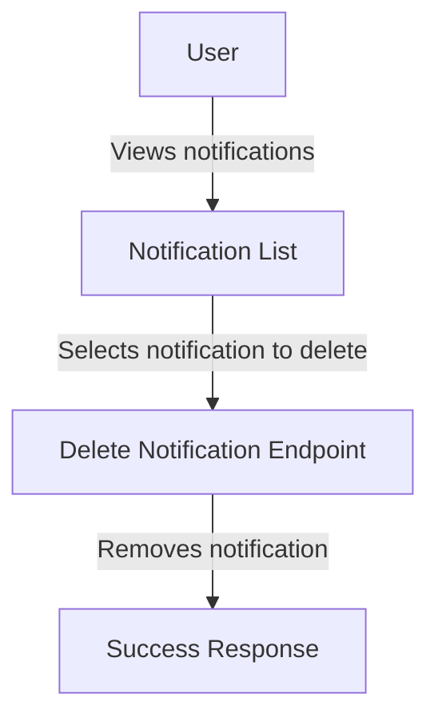

# Delete Notifications Flow Diagram

```mermaid
graph TD
    A[User] -->|Views notifications| B[Notification List]
    B -->|Selects notification to delete| C[Delete Notification Endpoint]
    C -->|Removes notification| D[Success Response]
```
