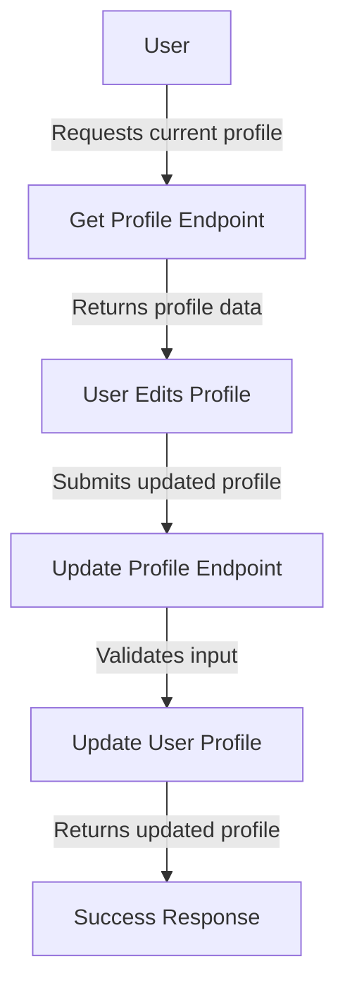

# Edit User Profile Flow Diagram

```mermaid
graph TD
    A[User] -->|Requests current profile| B[Get Profile Endpoint]
    B -->|Returns profile data| C[User Edits Profile]
    C -->|Submits updated profile| D[Update Profile Endpoint]
    D -->|Validates input| E[Update User Profile]
    E -->|Returns updated profile| F[Success Response]
```
