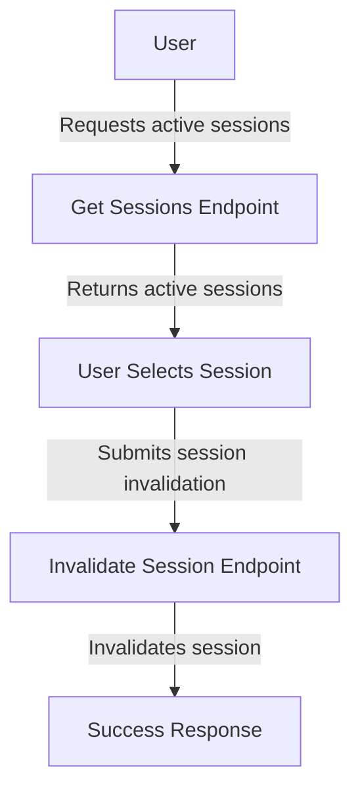

# Manage User Sessions Flow Diagram

```mermaid
graph TD
    A[User] -->|Requests active sessions| B[Get Sessions Endpoint]
    B -->|Returns active sessions| C[User Selects Session]
    C -->|Submits session invalidation| D[Invalidate Session Endpoint]
    D -->|Invalidates session| E[Success Response]
```
