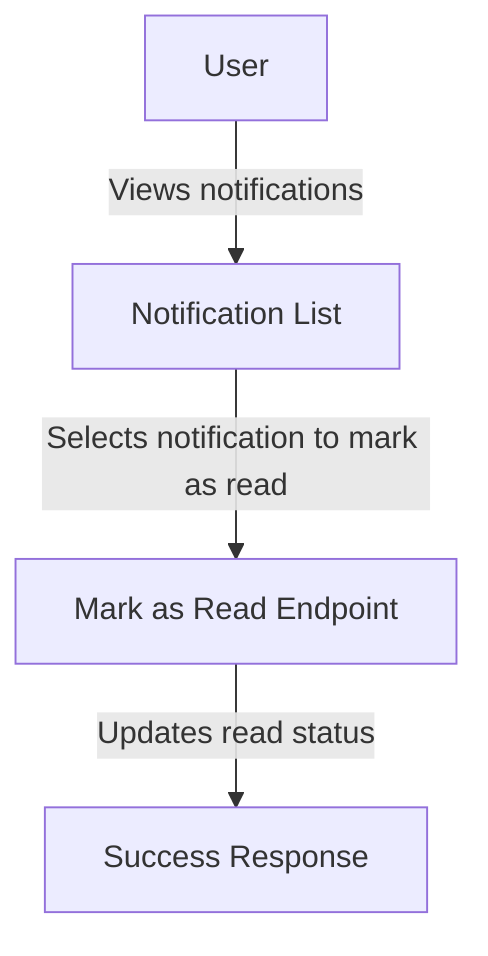

# Mark Notifications as Read Flow Diagram

```mermaid
graph TD
    A[User] -->|Views notifications| B[Notification List]
    B -->|Selects notification to mark as read| C[Mark as Read Endpoint]
    C -->|Updates read status| D[Success Response]
```
