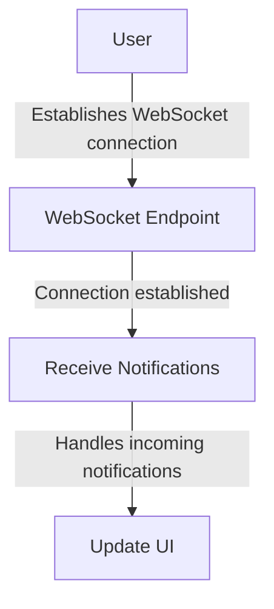

# Real-time Notifications Flow Diagram

```mermaid
graph TD
    A[User] -->|Establishes WebSocket connection| B[WebSocket Endpoint]
    B -->|Connection established| C[Receive Notifications]
    C -->|Handles incoming notifications| D[Update UI]
```
