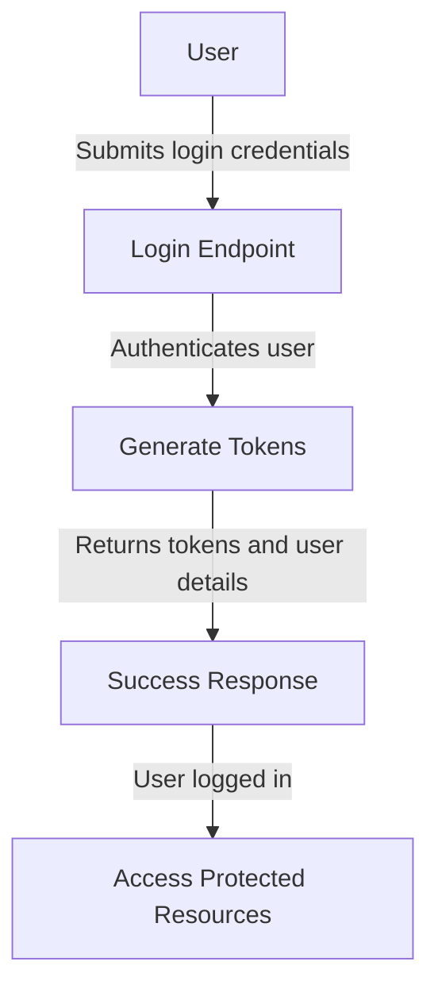

# User Login Flow Diagram

```mermaid
graph TD
    A[User] -->|Submits login credentials| B[Login Endpoint]
    B -->|Authenticates user| C[Generate Tokens]
    C -->|Returns tokens and user details| D[Success Response]
    D -->|User logged in| E[Access Protected Resources]
```
