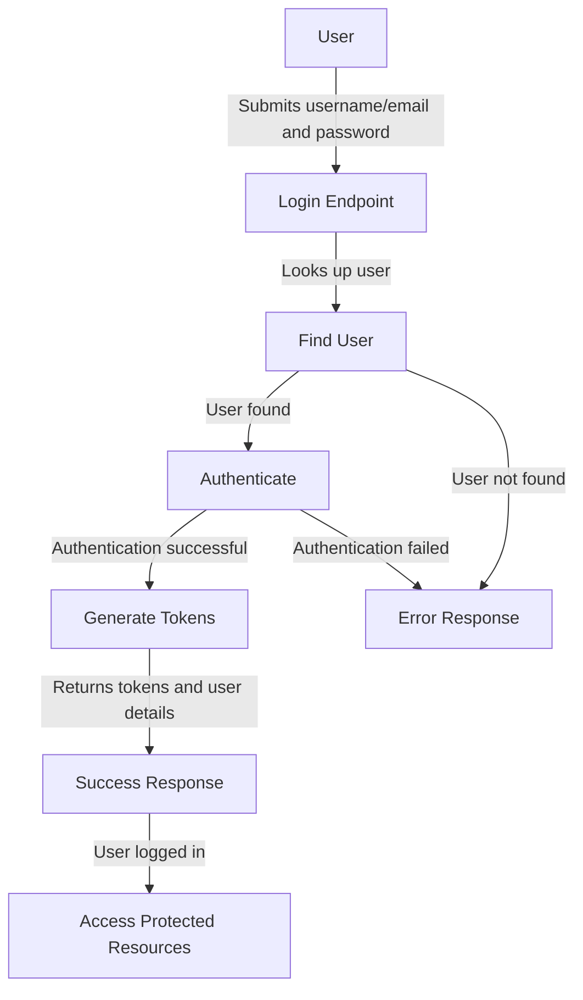

# User Login Flow Diagram

```mermaid
graph TD
    A[User] -->|Submits username/email and password| B[Login Endpoint]
    B -->|Looks up user| C[Find User]
    C -->|User found| D[Authenticate]
    D -->|Authentication successful| E[Generate Tokens]
    E -->|Returns tokens and user details| F[Success Response]
    F -->|User logged in| G[Access Protected Resources]

    C -->|User not found| H[Error Response]
    D -->|Authentication failed| H
```
