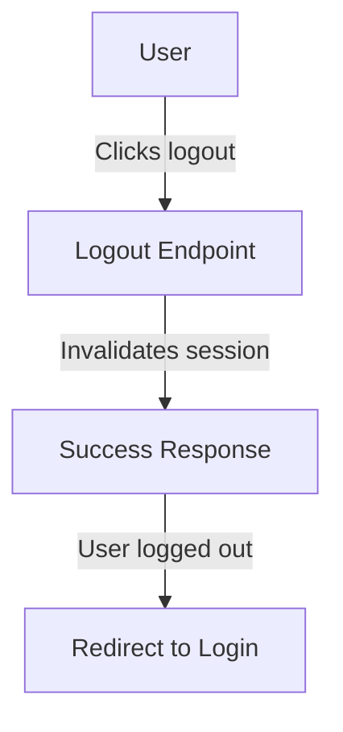

# User Logout Flow Diagram

```mermaid
graph TD
    A[User] -->|Clicks logout| B[Logout Endpoint]
    B -->|Invalidates session| C[Success Response]
    C -->|User logged out| D[Redirect to Login]
```
