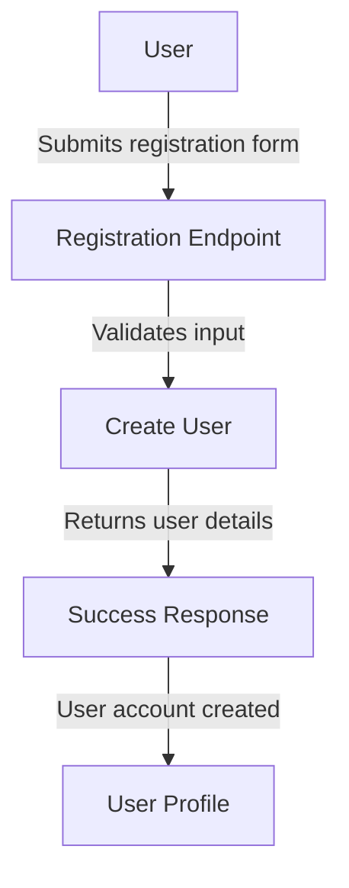

# User Registration Flow Diagram

```mermaid
graph TD
    A[User] -->|Submits registration form| B[Registration Endpoint]
    B -->|Validates input| C[Create User]
    C -->|Returns user details| D[Success Response]
    D -->|User account created| E[User Profile]
```
