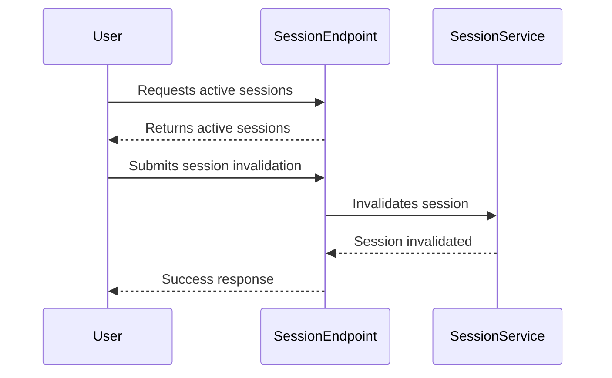

# Manage User Sessions Sequence Diagram

```mermaid
sequenceDiagram
    participant User
    participant SessionEndpoint
    participant SessionService

    User->>SessionEndpoint: Requests active sessions
    SessionEndpoint-->>User: Returns active sessions
    User->>SessionEndpoint: Submits session invalidation
    SessionEndpoint->>SessionService: Invalidates session
    SessionService-->>SessionEndpoint: Session invalidated
    SessionEndpoint-->>User: Success response
```
