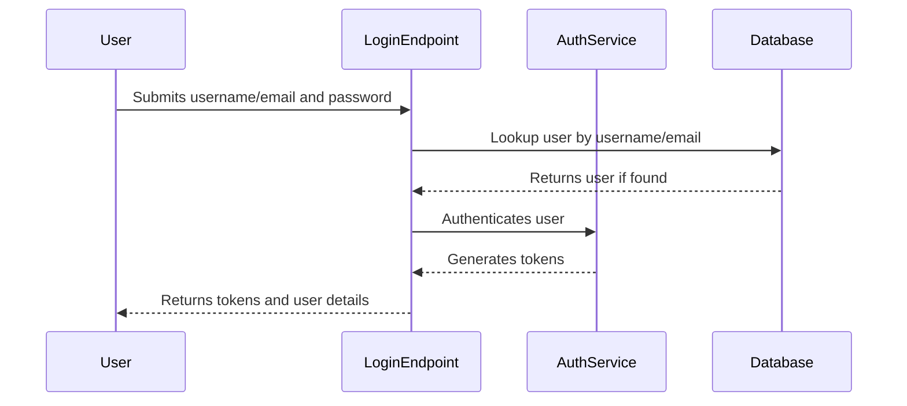

# User Login Sequence Diagram

```mermaid
sequenceDiagram
    participant User
    participant LoginEndpoint
    participant AuthService
    participant Database

    User->>LoginEndpoint: Submits username/email and password
    LoginEndpoint->>Database: Lookup user by username/email
    Database-->>LoginEndpoint: Returns user if found
    LoginEndpoint->>AuthService: Authenticates user
    AuthService-->>LoginEndpoint: Generates tokens
    LoginEndpoint-->>User: Returns tokens and user details
```
