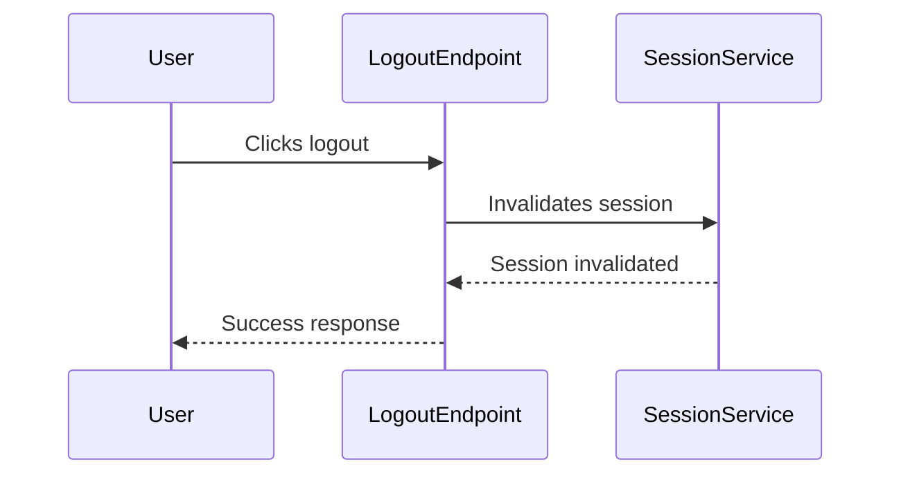

# User Logout Sequence Diagram

```mermaid
sequenceDiagram
    participant User
    participant LogoutEndpoint
    participant SessionService

    User->>LogoutEndpoint: Clicks logout
    LogoutEndpoint->>SessionService: Invalidates session
    SessionService-->>LogoutEndpoint: Session invalidated
    LogoutEndpoint-->>User: Success response
```
